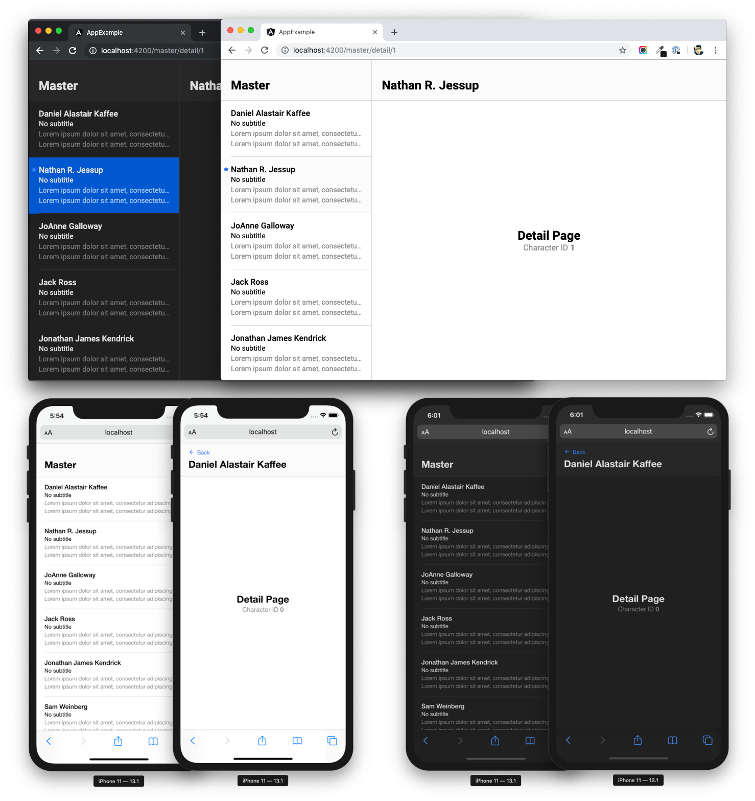

# **Angular** Master-Detail Component + Dark Mode

A quick experiment and demo of a responsive `master-detail` component in angular. This is a companion repo for the following [blog post](https://medium.com/@blewpri/angular-8-responsive-master-detail-3b4d591b3294).



## Quickstart

Run `npm i`, and then `ng serve` to spin up dev server. Then navigate to `http://localhost:4200/`.

## Code Overview

We have 2 Projects:
1. **lib-master-detail**: Contains the `master-detail` angular component and directive
2. **app-example**: A concrete example of the `master-detail` in action

## How It Works &middot; TLDR

Basically, there are three main tricks to make this work:

1. Set Up Routes As Both Siblings and Children

2. Use the `<lib-maser-detail>` component to switch between desktop and mobile views

3. Use the `libMasterRouterLink` directive (instead of angulars `routerLink`) for `master` page route navigation

## How It Works &middot; Detail

### 1. Set Up Routes As Both Siblings and Children

Firstly, be sure to use relative routing. Then we simply parameterize the `detail` routes, then add these as both children and siblings in the routing config. See:

```
// Parameterize `detail` routes
const detailRoutes = [
  {
    path: 'detail/:id',
    component: DetailComponent
  }
];

const routes: Routes = [
  {
    path: 'master',
    component: MasterComponent,
    children: [
      // Mobile 'Detail' Routes
      // are children of the master...
      ...detailRoutes
    ]
  },
  // Desktop 'Detail' Routes
  // are siblings of the master...
  ...detailRoutes
];
```
*projects/app-example/src/app/app-routing.module.ts* *(a simplified version)*

### 2. Use the `<lib-maser-detail>` component to switch between desktop and mobile views
 
* **Desktop** mode: *master* and *detail* views are displayed side-by-side
* **Mobile** mode: *master* and *detail* views are displayed as separate pages

The key thing to understand here is that routing is preserved for both views. In **Desktop* mode, this is done via and additional angular `<router-routlet>` in the `<lib-master-detail>` component. See:

```
<section class="__master"
  [class.--is-desktop]="breakpoints.isDesktop">

  <ng-content>

    <!-- Consuming pages/components will add there
         master content in here... -->

  </ng-content>

</section>

<section class="__detail"
  *ngIf="breakpoints.isDesktop">

  <!-- On desktop, we're going to have a side-by-side
       master-detail view, but we still want to keep
       routing. Hence, the router-outlet below -->

  <router-outlet #detailOutlet
    (activate)="onOutletActivated($event)"
    (deactivate)="onOutletDeactivated($event)">
  </router-outlet>

</section>

```
*projects/lib-master-detail/src/app/components/master-detail/master-detail.component.html* *(a simplified version)*

### 3. Use the `libMasterRouterLink` directive (instead of angulars `routerLink`) for `master` page route navigation

This is a simple angular directive that extends angulars `RouterLink` directive. It's only purpose is to swap the `routers` `relativeTo` param depending on the current screen size. See:

```
@HostListener('click')
onClick(): boolean {

  const myRoute = this.breakpointService.isDesktop ? this.myRoute : this.myRoute.parent;
  this.myRouter.navigate(this.myCommands, { relativeTo: myRoute });

}
```
*projects/lib-master-detail/src/app/directives/master-router-link.directive.ts* *(a simplified version)*

## Example Usage

In our sample app (started with `ng serve`), you can see a live example of all of this in action.

```
<lib-master-detail>

  <app-header
    [title]="'Master'">
  </app-header>

  <ul>

    <li *ngFor="let character of (characters$ | async)">

      <app-list-item
        [libMasterRouterLink]="['detail', character.id]">
      </app-list-item>

    </li>

  </ul>

</lib-master-detail>
```
*projects/app-example/src/app/pages/master/master.component.html* *(a simplified version)*

## BONUS: Dark Mode

Just for fun, the demo app supports dark mode on mac and ios. This is was done using simple CSS queries and the 'dark mode' query. See:

```
:root {

  --app-color-primary: rgb(52,120,245);

  /**********************************************/
  /* LIGHT MODE (DEFAULT)                       */
  /**********************************************/

  --app-color-background: rgb(255,255,255);
  --app-color-background-transparent: rgba(251,251,251,0.9);
  --app-color-background-highlight: rgba(251,251,251,0.9);

  --app-color-border: rgb(218,218,218);

  --app-color-text-primary: rgb(0,0,0);
  --app-color-text-primary-highlight: rgb(0,0,0);
  --app-color-text-secondary: rgb(142,141,146);
  --app-color-text-secondary-highlight: rgb(142,141,146);


  @media (prefers-color-scheme: dark) {

    /**********************************************/
    /* DARK MODE                                  */
    /**********************************************/

    --app-color-background: rgb(32,32,32);
    --app-color-background-transparent: rgba(40,40,40,0.9);
    --app-color-background-highlight: rgb(0,88,208);

    --app-color-border: rgb(45,45,45);

    --app-color-text-primary: rgb(223,223,223);
    --app-color-text-primary-highlight: rgb(223,223,223);
    --app-color-text-secondary: rgb(120,120,120);
    --app-color-text-secondary-highlight: rgba(255,255,255,0.6);

  }

}
```
*projects/app-example/src/app/styles/_colors.scss* *(a simplified version)*

## About
This project was generated with [Angular CLI](https://github.com/angular/angular-cli) version 8.3.4.
